# Dokumentáció
##Koktél receptek
Készítette: Peknyó Szilvia

###1.	Követelményanalízis

#####1.1.	Célkitűzés, projektindító dokumentum
A program legfőbb célja jól átláthatóan, és érthetően megjeleníteni az adott koktélok, és italok főbb tulajdonságait, és receptjüket egy webes vastagkliens, azaz egyoldali alkalmazás felhasználásával. A felhasználó a koktélok listáját megtekintheti, bővítheti, meglévő elemeket törölhet, valamint megjegyzéseket írhat.

######Funkcionális követelmények:
* új ital felvételére a listába
* a meglévő italok megtekintése
* a meglévő italok szerkesztésére
* a meglévő italok törlésére
* komment írása

######Nem funkcionális követelmények:
*	**Használhatóság:** Könnyű áttekinthetőség, ésszerű elrendezés, könnyen kezelhetőség
*	**Megbízhatóság:** Hibásan bevitt adatok esetén a program jól láthatóan jelezzen a felhasználónak, és emelje ki a hibás beviteli mezőket. A jól bevitt adatok maradjanak az űrlapban.
*	**Karbantarthatóság:** könnyen lehessen bővíteni, a különböző típusú fájlok külön csoportosítva, ésszerűen legyenek felbontva, a könnyebb fejleszthetőség miatt

#####1.2.	Szakterületi fogalomjegyzék
**Fajták:**
* **Shot:** Felespohárban felszolgált, gyakran csak alkoholt tartalmazó ital.
* **Cocktail:** Koktélos pohárban, szirupokkal, gyömülcslevekkel készített ital.
* **Long drink:** Egyszerű long-os pohárban felszolgált ital, gyakran egy fajta alkoholt és üdítőt tartalmaz.
* **Aperitif:** Étkezések előtt, étvágy fokozás céljából fogyasztott ital.

**Alap ital:** A koktélban legnagyobb arányban részt vevő tömény alkohol.

**Long-os pohár:** Nagy méretű koktélos pohár, amely egy vizespohárhoz hasonlít.

#####1.3.	Használatieset-modell, funkcionális követelmények

**Felhasználók**:

*	Új recept felvétele
*	Meglévő recept megtekintése
*	Meglévő recept szerkesztése
*	Meglévő recept törlése
*	Komment írása

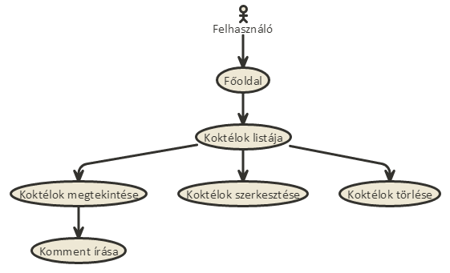

Vegyünk példának egy egyszerű folyamatot:

**Meglévő recept szerkesztése:**

1.	A felhasználó az oldalra érkezve megtekintheti a recepteket listázó oldalt, ahol kiválaszthatja a szerkeszteni kívánt receptet.
2.	Megnyomja a „Szerkesztés” feliratú gombot
3.	Szerkesztés oldalon felviszi az új adatokat
4.	Submit gombra kattintva elmenti a változásokat

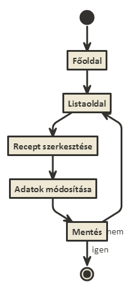

###2.	Tervezés

#####2.1.	Architektúra terv

######2.1.1. Komponensdiagram

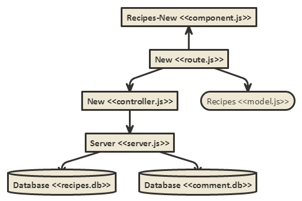

######2.1.2. Oldaltérkép:

**Felhasználó:**
* Főoldal
* Új koktél felvétele
* Listaoldal
  * Koktél törlése 
  * Koktél megtekintése
    * Komment hozzáfűzése
  * Koktél szerkesztése 

######2.1.3. Végpontok


**RestAPI végpontok:**
* GET /recipe: Összes adat lekérdezése a recipe modellből
* POST /recipe: Új elem felvétele a recipe modellbe 
* GET /comment: Összes adat lekérdezése a comment modellből
* POST /comment: Új elem felvétele a comment modellbe 


#####2.2. Felhasználói-felület modell

######2.2.1.Oldalvázlatok:
**Főoldal**

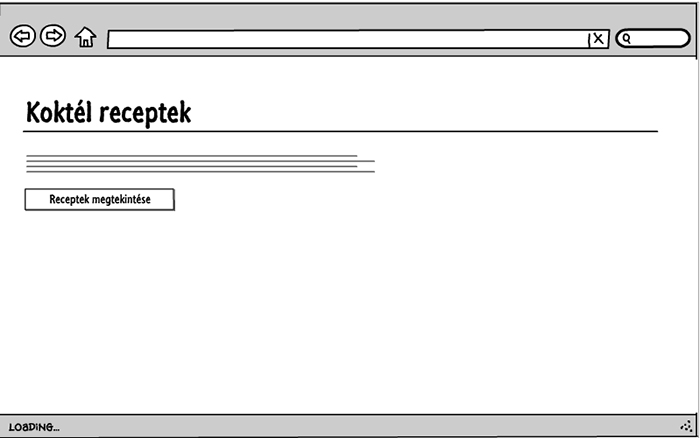

**Koktél listaoldal**

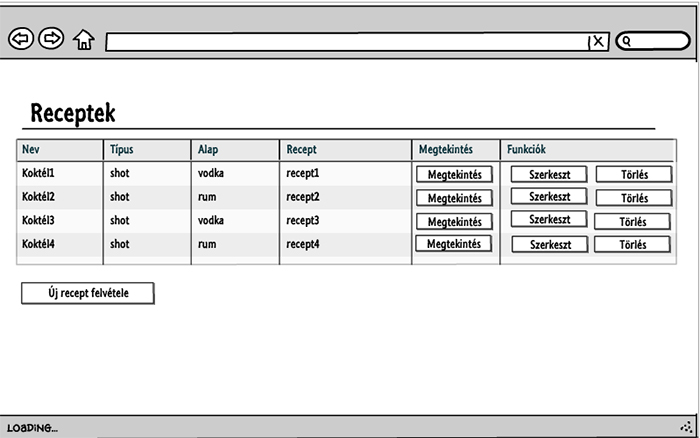

**Új koktél felvétele**

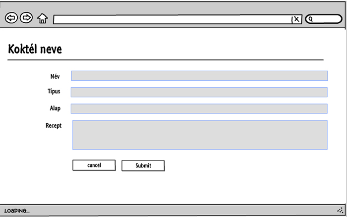

**Koktél megtekintése**

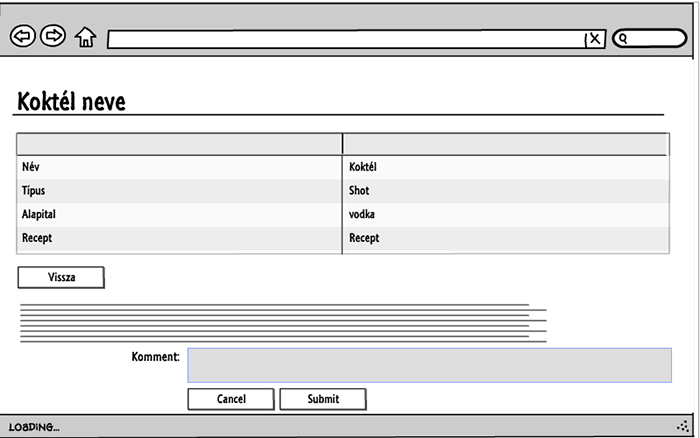

######2.2.2.Designtervek (végső megvalósítás kinézete):

**Főoldal**

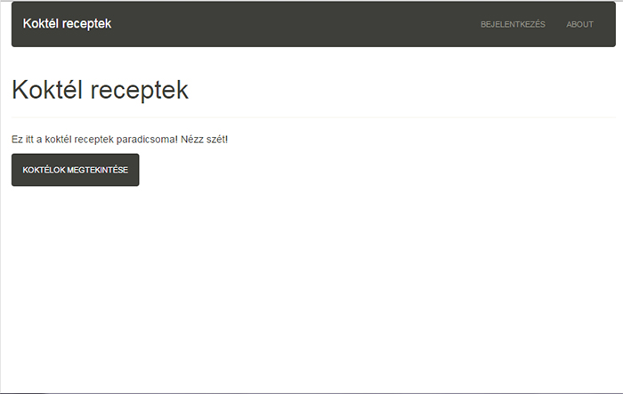

**Koktél listaoldal**


**Új koktél felvétele**

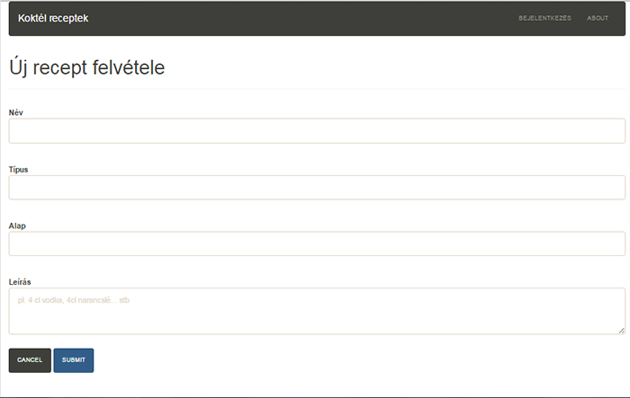

**Koktél megtekintése**

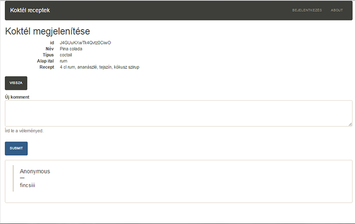

######2.2.3. Osztálymodell

 **Adatmodell**
 
 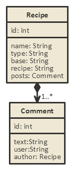
 
 **Adatbázisterv**
 
 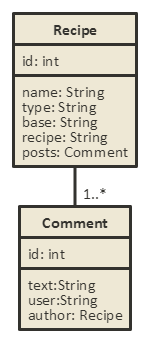
 
######2.2.4.  Dinamikus működés

 **Szekvenciadiagram**
 
 Vegyük példának egy új elem felvételét, mindezt szekvenciadiagrammon.
 
 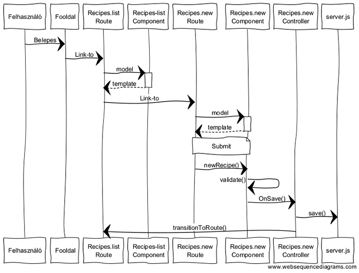

###3.	Implementáció
######3.1.1. Fejlesztőkörnyezet

Webes IDE: **Cloud9**

* Github account szükséges
* Belépés után új workspace létrehozása (node.js)
* Ezután elkezdhetjük a kód írását


######3.1.2. Könyvtárstruktúra, funkciók

* **Beadando**
  * **app**
    * **pods**
      * **application**: adapter
        * _adapter.js_ 
      * **comment**: komment modell
        * _model.js_
      * **components**: komponensek,
        * **recipes-comment** 
          * _component.js_
          * _template.hbs_
        * **recipes-edit** 
          * _component.js_
          * _template.hbs_
        * **recipes-list** 
          * _component.js_
          * _template.hbs_
        * **recipes-new** 
          * _component.js_
          * _template.hbs_
        * **recipes-newcomment** 
          * _component.js_
          * _template.hbs_
      * **index**: főoldal
        * _template.hbs_
      * **recipe**: recept modell
        * _model.js_
      * **recipes**: recept route-ok, és controllerek
        * **edit**
          * _controller.js_
          * _route.js_
          * _template.hbs_
        * **list**
          * _controller.js_
          * _route.js_
          * _template.hbs_
        * **new**
          * _controller.js_
          * _route.js_
          * _template.hbs_
        * **view**
          * _controller.js_
          * _route.js_
          * _template.hbs_
  * **templates**
    * **components**
      * _application.hbs_
  * _router.js_: Router.map

###4.	Tesztelés
#####4.1. Tesztelési környezetek

A RestAPI server végpontjait a _Advanced REST Client_ végponttesztelő alkalmazással teszteljük, Chrome böngésző környezetben.

#####4.2. Tesztesetek

######4.2.1 Összes elem lekérdezése GET metódussal
**Küldött kérés:**
```
https://ckd193-restapi-pessaai.c9users.io/recipes
```
**Metódus:** GET

**Kapott válasz:**
```
Status
200 OK  Loading time: 378
```

######4.2.2 Konkrét elem lekérdezése GET metódussal

**Küldött kérés:**
```
https://ckd193-restapi-pessaai.c9users.io/recipes/J4GUuKXwTk4Qvtz0CiwO
```
**Metódus:** GET

**Kapott válasz:**
```
Status
200 OK  Loading time: 378
```
######4.2.3 Új elem létrehozása POST metódussal

**Küldött kérés:**
```
https://ckd193-restapi-pessaai.c9users.io/recipes
```
**Metódus:** POST

**Kérés törzse:**
```
{
    "data": {
	"type": "recipe",
        "attributes": {
		"name": "proba koktel",
		"type": "long drink",
		"base": "rum",
		"recipe": "narancsle"
        },
        "relationships": {
            "posts": {
                "data": { "type": "comments", "id": "J8WypEA/UNJVxqdAE/oL" }
            }
        }
    }
}
```

**Kapott válasz:**
```
Status
201 Created  Loading time: 233
```
######4.2.3 Elem törlése a DELETE metódussal

**Küldött kérés:**
```
https://ckd193-restapi-pessaai.c9users.io/recipes/vwN70MEPsSdGbmF45WAt
```
**Metódus:** DELETE

**Kapott válasz:**
```
Status
204 No Content  Loading time: 74
```


###5.	Felhasználói dokumentáció

**Futtatáshoz szükséges operációs rendszer:** Tetszőleges operációs rendszer

**A futtatáshoz szükséges hardver:** Operációs rendszerek szerint megadva

**Egyéb követelmények:** Internet böngésző telepítése, JavaScript ajánlott

**Program használata:**

1. Böngészőben nyissuk meg a főoldalt
2. Kattintsunk a koktélok megtekintése gombra
3. A Lista oldalra jutunk
4. Bal alsó sarokban az Új recept felvitele gombra kattintva tudunk új recepteket felvenni a listába
5. Töltsük ki az űrlapot
6. Hibás adatok esetén az űrlap jelezni fogja a hibát
7. Submit gombra kattintva mentsük el az adatokat
8. Lista oldalon: Törlés gombra kattintva törölhetjük a receptet
9. Lista oldalon: Megtekint gombra kattintva a megtekintés oldalra jutunk
10. Lista oldalon: Szerkesztés gombra kattintva a szerkesztés oldalra jutunk
11. Szerkesztés oldal: megegyezik az új recept felvitel funkcióval, csak előre láthatóak benne a recept eddigi adatai, az új adatok felvitele után a submit gombra kattintva elmenthetjük az adatokat. Utána vissza jutunk a lista oldalra.
12. Megtekintés oldal: Felül látjuk a recept pontos adatait. Itt van lehetőség komment írásása. Írjuk be a kommentet, és nyomjuk meg a submit gombot. Az új komment megjelenik alul a listában. A vissza gombbal a lista oldalra jutunk.

###6.	Irodalomjegyzék:

http://webprogramozas.inf.elte.hu/alkfejl.php

http://ade.web.elte.hu/wabp/lecke2_lap1.html

http://webprogramozas.inf.elte.hu/alkfejl/A_dokumentacio_felepitese.pdf
